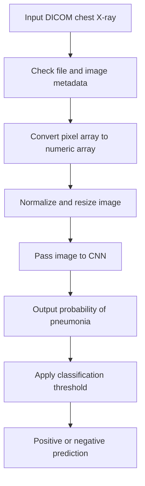

# FDA Submission

**Your Name:** Elena Eyre

**Name of your Device:** Chest X-Ray Pneumonia Classification Algorithm

## Algorithm Description

### 1. General Information

**Intended Use Statement:**
This device is intended to assist clinicians by providing a binary classification of frontal-view chest X-ray images as likely positive or negative for pneumonia. The algorithm is designed to support radiology workflow by flagging studies that may warrant additional review, rather than replacing clinician judgment.

**Indications for Use:**
The algorithm is intended for use on frontal-view chest X-ray studies from patients with suspected pneumonia. It may be used as a triage aid in settings where a radiologist or clinician is reviewing chest X-rays for possible pneumonia.

**Device Limitations:**
The algorithm is not intended to be a standalone diagnostic tool and should not be used without clinician oversight. It may be less reliable for cases with overlapping lung findings, low-quality images, unusual anatomy, or conditions that mimic pneumonia. It is also not intended to differentiate bacterial from viral pneumonia or to replace microbiologic or clinical assessment.

**Clinical Impact of Performance:**
False positives may lead to unnecessary treatment or further diagnostic workup, while false negatives may delay diagnosis and treatment. The algorithm is therefore best used as a decision-support tool that can help prioritize review while preserving clinical judgment.

### 2. Algorithm Design and Function

**DICOM Checking Steps:**
The inference workflow reads a DICOM file with the pydicom library, verifies that the file exists, and extracts the pixel array for downstream preprocessing. The notebook also uses the image array as the input to the classification pipeline.

**Preprocessing Steps:**
The preprocessing pipeline converts the DICOM pixel array to a floating-point array, normalizes pixel intensities, resizes the image to 224 x 224 pixels, and expands the input to three channels to match the expected model input shape. A default normalization scheme of mean subtraction and standard-deviation scaling is used in the inference notebook.

**CNN Architecture:**
The model uses transfer learning with a VGG16 backbone pretrained on ImageNet. The pre-trained base is used as a feature extractor, and a binary classifier head is added on top with a Flatten layer, a Dense(64, ReLU) layer, and a final Dense(1, Sigmoid) output layer for pneumonia classification.

### 3. Algorithm Training

**Parameters:**
- Types of augmentation used during training: random rotation, width and height shifts, shear, zoom, horizontal flips, brightness adjustment, and rescaling
- Batch size: 32
- Optimizer: Adam with the default Keras optimizer settings
- Layers of pre-existing architecture that were frozen: the VGG16 feature-extraction layers were frozen during the initial transfer-learning setup
- Layers of pre-existing architecture that were fine-tuned: no additional VGG16 layers were fine-tuned in the starter implementation; the pre-trained backbone was used as a fixed feature extractor
- Layers added to pre-existing architecture: Flatten, Dense(64, ReLU), Dense(1, Sigmoid)

Training performance was monitored with training and validation loss curves, ROC-AUC, and confusion-matrix plots. The notebook also includes a threshold-selection step that evaluates thresholds across a range from 0.0 to 1.0 and selects the threshold that maximizes validation accuracy.

**Final Threshold and Explanation:**
The training notebook includes a threshold-search procedure to select a classification threshold based on validation performance. In the starter implementation, a default threshold of 0.5 is used as the baseline, and the final threshold is selected by optimizing validation accuracy while balancing sensitivity and specificity.

### 4. Databases

**Description of Training Dataset:**
The model was developed using the NIH Chest X-Ray dataset, which contains frontal-view chest X-ray images paired with radiology-report-derived labels. The project notebook builds a binary pneumonia label from the structured metadata and uses an 80/20 train/validation split with stratification by pneumonia label to preserve class balance.

**Description of Validation Dataset:**
The validation dataset is derived from the same NIH source data and is held out from model training. It is used to evaluate model performance after training and to select the final classification threshold. The validation split is stratified to preserve the relative prevalence of pneumonia-positive and pneumonia-negative cases.

### 5. Ground Truth

The reference labels used in this project were derived from the NIH Chest X-Ray dataset metadata, where disease labels were extracted from radiology reports using natural language processing. This approach makes large datasets feasible for model development, but it can introduce label noise because the labels are not always manually verified. The notebook and README note that the NLP-derived labels are helpful for training but may contain some inaccuracies.

### 6. FDA Validation Plan

**Patient Population Description for FDA Validation Dataset:**
A prospective validation dataset should include a representative clinical population with suspected pneumonia, including a range of ages, both sexes, and a mix of pneumonia-positive and pneumonia-negative cases. The dataset should include frontal chest X-rays and should reflect real-world clinical practice, including cases with common co-existing thoracic findings.

**Ground Truth Acquisition Methodology:**
Ground truth should be established by independent expert review, ideally through adjudication by board-certified radiologists or another consensus-based process. Clinical context, follow-up information, and relevant diagnostic results should be used when available to support the final reference label.

**Algorithm Performance Standard:**
The algorithm should meet or exceed clinically meaningful performance benchmarks for pneumonia detection, with emphasis on sensitivity and specificity appropriate for a triage-support role. A practical performance target would be a high sensitivity to reduce missed pneumonia cases while maintaining acceptable specificity to avoid excessive false positives.
